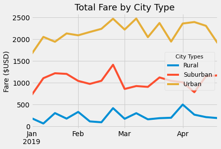

# An Analysis of PyBer's Ride-Sharing Data

### Jupyter Notebook File:
[PyBer_Challenge](PyBer_Challenge.ipynb)

### PyBer CSV Datasheets:
- [city_data](Resources/city_data.csv)
- [ride_data](Resources/ride_data.csv)

## **Overview**:

## **Results**:

## **Summary**:

### *Recommendations*:
1. 
2. 
3. 
