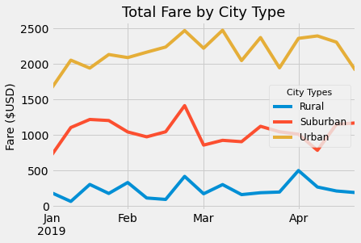
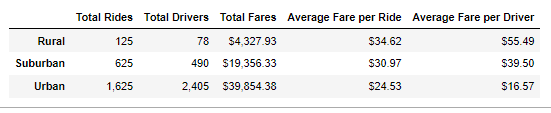

# An Analysis of PyBer's Ride-Sharing Data

### PyBer Performance By City Types Main File:
[PyBer_Challenge](PyBer_Challenge.ipynb)

#### *Initial Analysis Notebook File*:
[PyBer_Analysis](PyBer_Analysis.ipynb)

#### PyBer CSV Datasheets:
- [city_data](Resources/city_data.csv)
- [ride_data](Resources/ride_data.csv)

## **Overview**:
It would be a fair expectation that a ride-share business's success varies based on the population density and level of urban development present in whichever location the business operates in. Based on this expectation, an analysis was conducted to test the validity of this theory and to measure the extent of the theory's accuracy or inaccuracy based on the data from locations in different states of urban development. By applying the tools available from Python and Pandas within the Jupyter Notebook application, it was possible to create a visual presentation of this analysis and to determine the results from a single image comparing the analyzed data values.

## **Results**:
The results of this analysis clearly show the theory considered at the start of this analysis was correct, and the success of the ride-sharing business PyBer is strongly affected by the degree of urban development present in the locations that the business operates. Not only did this analysis conclude that this theory was accurate, it concluded this accuracy with calculated values that distinctly show the trend between weekly fare sums paid by the customers over the course of several months, and the difference of fares paid between the levels of urban development. As shown in the chart below: the "Rural" location type had weekly fares that barely reached a high at the $500 level, while the "Suburban" and "Urban" types had fares that varied at a range of nearly $1,000 between their respective highest and lowest values. Despite this variance, though, the "Suburban" and "Rural" location types had values that consistently were around $1,000 difference between their data points. This meant the level of urban development had enough of an impact to clearly show the performances without anything close to an overlap and showed with each location's urban development type there was an increasing $1,000 improvement as they became more urbanized.

### *Weekly Fare Totals by City Type Chart*:

In addition to the trends shown in the chart based on weekly fare totals, a summary table of the values related to the levels of urbanization was also created and uses a more simplified approach to show the dramatic overall income differences between the different city types.
### *PyBer Summary Table*:

## **Summary**:

### *Recommendations*:
1. 
2. 
3. 
